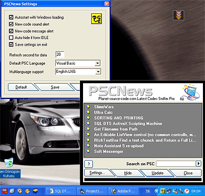



## PSCNews New Code Alert\!

### Description

If you are learn new source code topics, this program is this for you!

* Setting panel

* Language Support (Learn language using..)

* New code alerts (If added)

* SYSTray mode (Learn)

* Beautiful design form

* Search mode.

Thanks for your votes.
 
### More Info
 

             |
---                |---
**Submitted On**   |2004-01-07 04:46:42
**By**             |[B\.Cem HANER](https://github.com/Planet-Source-Code/PSCIndex/blob/master/ByAuthor/b-cem-haner.md)
**Level**          |Intermediate
**User Rating**    |4.5 (36 globes from 8 users)
**Compatibility**  |VB 6\.0
**Category**       |[Complete Applications](https://github.com/Planet-Source-Code/PSCIndex/blob/master/ByCategory/complete-applications__1-27.md)
**World**          |[Visual Basic](https://github.com/Planet-Source-Code/PSCIndex/blob/master/ByWorld/visual-basic.md)
**Archive File**   |[PSCNews\_Ne174066532004\.zip](https://github.com/Planet-Source-Code/b-cem-haner-pscnews-new-code-alert__1-53540/archive/master.zip)

